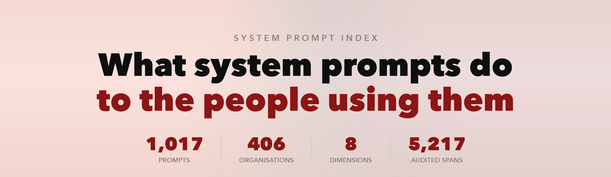
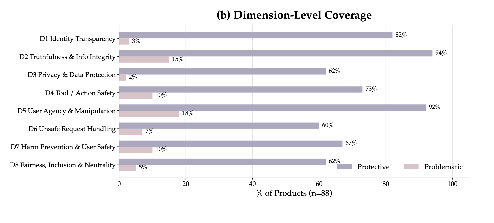

<p align="center">
  
</p>

<p align="center">
  <a href="https://systempromptindex.com"><b>systempromptindex.com</b></a> &nbsp;·&nbsp;
  <a href="https://arxiv.org/abs/2607.28617">Paper</a> &nbsp;·&nbsp;
  <a href="https://systempromptindex.com/aispa">AISPA standard</a> &nbsp;·&nbsp;
  <a href="CONTRIBUTING.md">Contributing</a>
</p>

**1,017 system prompts from real AI products, read instruction by instruction.**
Every finding points at the exact span of text it is about, says which of eight
assurance dimensions it falls under, whether it protects the user or works
against them, and why.

## Quick start

```bash
git clone https://github.com/SystemPromptIndex/SystemPromptIndex.git
```

```python
import json

audits = json.load(open("data/audits.json"))

# Instructions that work against the user, with the reason
for a in audits:
    for s in a["spans"]:
        if s["score"] < 0:
            print(f'{a["product"]}  [{s["dimension"]}]  {s["text"][:70]}')
            print(f'    -> {s.get("note","")}\n')
```

```bash
# Products carrying the most problematic instructions
jq -r 'sort_by(-.problematic_entries)[:10]
       | .[] | "\(.problematic_entries)\t\(.company)/\(.product)"' data/audits.json

# Everything scored on privacy
jq '[.[] | .spans[] | select(.dimension=="D3")]' data/audits.json
```

Prompt bodies live in `prompts/`, one Markdown file each, so you can also just
browse the tree.

## What's in here

```
prompts/<org>/<product>.md     prompt text, with YAML front matter
audits/<org>/<product>.json    the audit for that prompt
data/prompts.json              every prompt in one file
data/audits.json               every audit in one file
dimensions.json                the eight dimensions, in full
```

`id` is the path under `prompts/` and `audits/`, so a record in the aggregate
always points at its own files. Per-file and aggregate views hold the same data.

| | |
|---|---:|
| Prompts | 1,017 |
| Organisations | 406 |
| Audited spans | 5,217 |
| Protective / problematic | 4,656 / 514 |

## The eight dimensions

| | | |
|:--|:--|:--|
| `D1` | Identity Transparency | Is it honest about being an AI? |
| `D2` | Truthfulness & Information Integrity | Does it avoid asserting what it can't support? |
| `D3` | Privacy & Data Protection | What does it do with what the user tells it? |
| `D4` | Tool/Action Safety | What may it do on the user's behalf? |
| `D5` | User Agency & Manipulation Prevention | Does it steer the user, or serve them? |
| `D6` | Unsafe Request Handling | What does it refuse, and how? |
| `D7` | Harm Prevention & User Safety | Does it avoid enabling harm and de-escalate risk? |
| `D8` | Fairness, Inclusion & Neutrality | Who does it treat differently? |

Coverage across the 88 products analysed in the paper is uneven, and the gaps
are not where you would guess:

<p align="center">
  
</p>

User agency has both the **highest** protective coverage (92%) and the
**highest** problematic rate (18%) — the dimension the field writes about most
is also the one it most often gets backwards. Privacy is the mirror image:
addressed less often (62%), but rarely wrong when it is (2%).

More figures, and the trend over time, are on the
[website](https://systempromptindex.com) and in the
[paper](https://arxiv.org/abs/2607.28617).

## Audit schema

Each file in `audits/` has the prompt's metadata plus a `spans` array. One span
is one finding.

| Field | Meaning |
|:--|:--|
| `text`, `start`, `end` | The exact instruction, and its character offsets into the prompt body |
| `dimension` | `D1`–`D8`, or `Misc` |
| `score` | `+1` protective, `-1` problematic |
| `note` | Why it was scored that way |
| `risky` | Borderline — user agency weighed against platform safety |

Offsets index the prompt body — the text *after* the front matter in the
matching `prompts/` file.

At the prompt level, `scores` / `by_dimension` / `protective_entries` /
`problematic_entries` summarise the spans.

### On method

This repository is the result of the audit, not an account of how it was run.
The procedure — how spans are identified, how dimensions are assigned, how
scores are arrived at and validated — is set out in the
[paper](https://arxiv.org/abs/2607.28617).

If you think a particular score is wrong, that is worth raising regardless of
how it was produced: see [CONTRIBUTING.md](CONTRIBUTING.md).

## Provenance

These are published system prompts, gathered from public collections — we did
not extract them. Credit to the projects that assembled them:
[TheBigPromptLibrary](https://github.com/0xeb/TheBigPromptLibrary) ·
[system_prompts_leaks](https://github.com/asgeirtj/system_prompts_leaks) ·
[awesome-ai-system-prompts](https://github.com/dontriskit/awesome-ai-system-prompts) ·
[CL4R1T4S](https://github.com/elder-plinius/CL4R1T4S) ·
[chatgpt_system_prompt](https://github.com/LouisShark/chatgpt_system_prompt) ·
[system-prompts-and-models-of-ai-tools](https://github.com/x1xhlol/system-prompts-and-models-of-ai-tools)

Prompt text belongs to whoever wrote it and is reproduced for research; we claim
nothing over it. The audits — spans, scores, notes, and the dimension
definitions — are ours, free to use with attribution.

Inclusion is not a claim that a prompt is authentic, current, or officially
released. Vendors change prompts without notice, and the corpus mixes agent
frameworks and open-source projects in with consumer products.

## Citing

```bibtex
@article{lin2026aispa,
  title={AISPA: Artificial Intelligence System Prompt Assurance -- User-Centric System Prompt Auditing for Large Language Model Applications},
  author={Lin, Xiangning and Zhu, Shenzhe and Yang, Shu and Zhang, Zhenyu and Zhang, Haoqian and Zhao, Yipeng and Qian, Chengxuan and Wang, Tianwei and Zhang, Ziheng and Yuan, Zhenlong and Wang, Dingcheng and Wu, Juncheng and Si, Yuan and Liu, Jiaxin and Bi, Baolong and Mahari, Robert and South, Tobin and Greenwood, Dazza and He, Zexue and Bommasani, Rishi and Kazinnik, Sophia and Haupt, Andreas and Marro, Samuele and Brynjolfsson, Erik and Pentland, Alex and Pei, Jiaxin},
  journal={arXiv preprint arXiv:2607.28617},
  year={2026}
}
```
