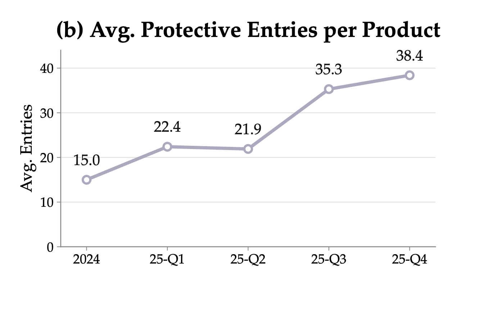
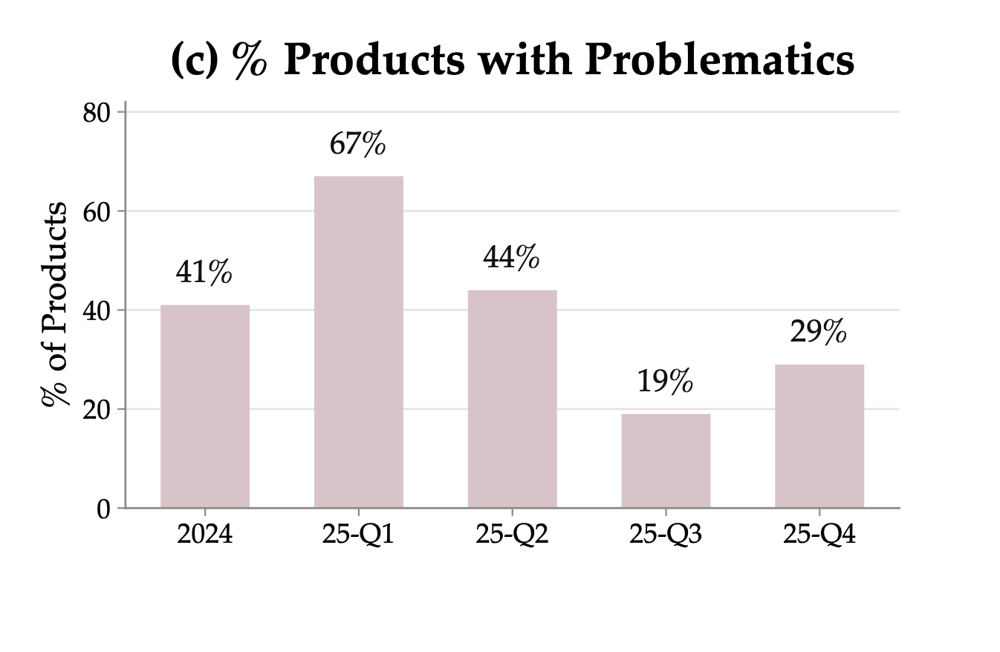
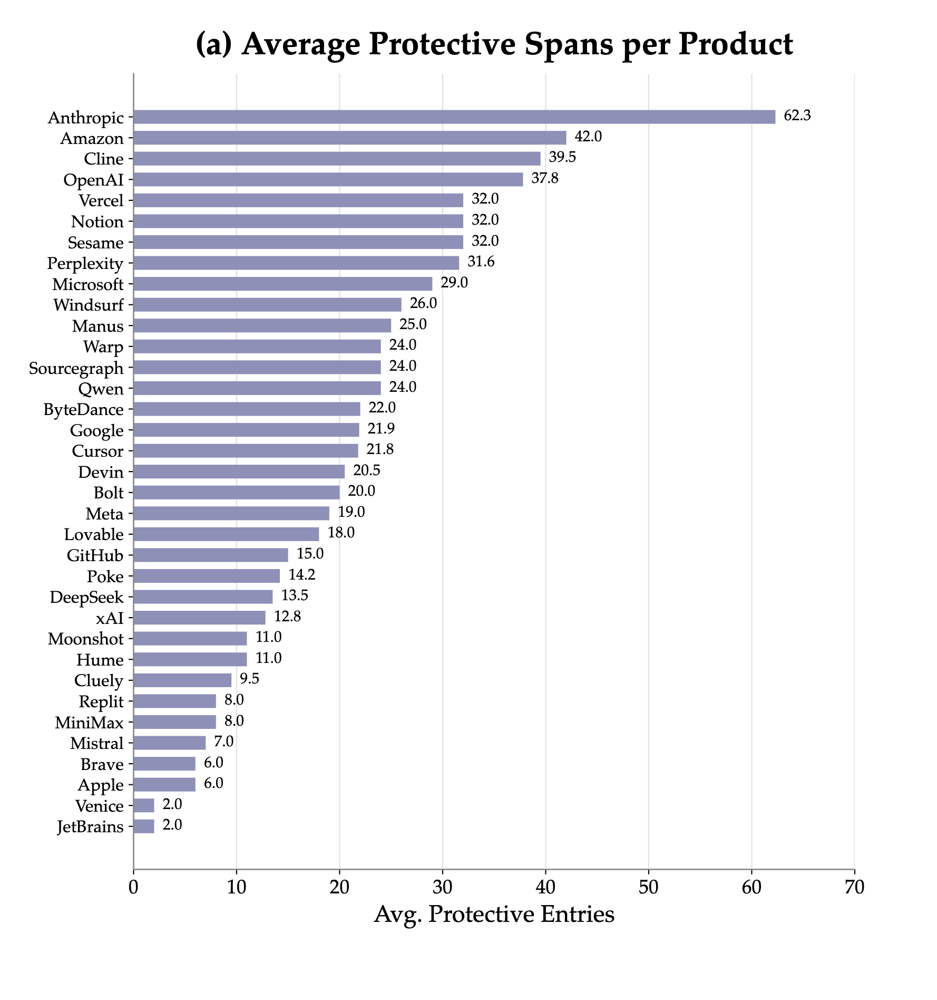

<p align="center">
  
</p>

<p align="center">
  <a href="https://systempromptindex.com"><b>systempromptindex.com</b></a>
  &nbsp;·&nbsp;
  <a href="https://arxiv.org/abs/2607.28617">Paper (arXiv:2607.28617)</a>
  &nbsp;·&nbsp;
  <a href="https://systempromptindex.com/aispa">The AISPA standard</a>
</p>

---

Every AI product ships a system prompt the user never sees. Some of those
instructions protect the person on the other side — refuse to impersonate a
human, don't retain personal data, don't manipulate. Others work against them.

This repository is the public record: **1,017 system prompts** from real
products and open-source agent projects, each read instruction by instruction
and scored against eight assurance dimensions. Every finding points at the exact
span of text it is about, and says why.

## At a glance

| | |
|---|---:|
| Prompts | **1,017** |
| Organisations | **406** |
| Audited spans | **5,217** |
| Protective entries | **4,656** |
| Problematic entries | **514** |
| Human-reviewed prompts | **88** |

## What the audits found

Protective instructions have been accumulating fast — the average product went
from 15 protective entries to 38 in five quarters. Problematic ones are thinning
out, but they have not disappeared.

<p align="center">
  
  
</p>

Coverage is not even. Truthfulness (94%) and user agency (92%) are close to
universal; unsafe-request handling (60%), privacy (62%) and fairness (62%) trail
by more than thirty points.

The interesting column is the other one. User agency has both the *highest*
protective coverage and the *highest* problematic rate — 18% of products carry
an instruction that works against the user on the very dimension the field
writes about most. Privacy is the mirror image: less often addressed, but when
it is addressed it rarely goes wrong (2%).

<p align="center">
  
</p>

The gap between products is wide. Ranked by protective entries, the top
organisations carry several dozen per product while others carry a handful.

<p align="center">
  
</p>

Figures are from the paper and describe the 88 human-reviewed prompts.
The [website](https://systempromptindex.com) plots the same series from the live
index, which has grown well past that set.

## The eight dimensions

| | | |
|---|---|---|
| **D1** | Identity Transparency | Is the system honest about being an AI? |
| **D2** | Truthfulness & Information Integrity | Does it avoid asserting what it cannot support? |
| **D3** | Privacy & Data Protection | What does it do with what the user tells it? |
| **D4** | Tool/Action Safety | What is it allowed to do on the user's behalf? |
| **D5** | User Agency & Manipulation Prevention | Does it steer the user, or serve them? |
| **D6** | Unsafe Request Handling | How does it refuse, and what does it refuse? |
| **D7** | Harm Prevention & User Safety | Does it avoid enabling harm, and de-escalate when a user is at risk? |
| **D8** | Fairness, Inclusion & Neutrality | Who does it treat differently? |

`Misc` collects entries that matter but sit outside the eight. Full definitions
are in [`dimensions.json`](dimensions.json).

## Layout

```
prompts/<org>/<product>.md     prompt text, with YAML front matter
audits/<org>/<product>.json    the audit for that prompt
data/prompts.json              every prompt in one file
data/audits.json               every audit in one file
dimensions.json                the eight dimensions and their definitions
```

Per-file and aggregate views hold the same records. Browse the tree on GitHub,
or load the two files under `data/` if you are working with the corpus
programmatically. `id` is the path under `prompts/` and `audits/`, so a record in
the aggregate always points at its own files.

## Audit format

```jsonc
{
  "id": "Anthropic/Claude_Opus_4_6",
  "company": "Anthropic",
  "product": "Claude Opus 4.6",
  "audit_type": "human-reviewed",   // or "automated"
  "reviewer": "human",              // or "auto"
  "scores": { "D1": 2, "D2": 1, "…": 0 },
  "protective_entries": 31,
  "problematic_entries": 2,
  "by_dimension": {
    "protective":  { "D1": 4, "…": 0 },
    "problematic": { "D1": 0, "…": 0 }
  },
  "spans": [
    {
      "text": "the exact instruction this finding is about",
      "start": 1204, "end": 1391,
      "dimension": "D3",
      "score": 1,                   // +1 protective, -1 problematic
      "note": "why it was scored this way",
      "risky": false,               // borderline: user agency vs. platform safety
      "source": "llm"               // llm | human | cross_version_unify | cross_version_review
    }
  ]
}
```

`start` and `end` are character offsets into the prompt body — the text after
the front matter in the matching `prompts/` file.

### How the audits were produced

Every prompt was audited span by span: a reviewer marks the exact instruction,
assigns it to a dimension, scores it protective or problematic, and writes a
short justification.

- **88 prompts** are `human-reviewed`. These are the set analysed in the paper.
  Reviewers worked from the same rubric, and their spans were reconciled across
  product versions.
- **929 prompts** are `automated`. They extend the corpus well past what the
  paper covers and have not been through human reconciliation.

`source` on a span records *how* that particular finding arrived — a language
model, a human reviewer, or propagation across versions of the same product.

Automated findings are a starting point, not a verdict. The paper's benchmark
section shows that automated auditors recall problematic spans well but
over-flag them, so precision is the weak axis. If a span looks wrong to you, it
may well be — see [CONTRIBUTING.md](CONTRIBUTING.md).

Individual reviewers and the specific models used are not recorded here.

## Where the prompts come from

These are published system prompts, gathered from public collections. We did not
extract them ourselves. Credit to the projects that assembled them:

[TheBigPromptLibrary](https://github.com/0xeb/TheBigPromptLibrary) ·
[system_prompts_leaks](https://github.com/asgeirtj/system_prompts_leaks) ·
[awesome-ai-system-prompts](https://github.com/dontriskit/awesome-ai-system-prompts) ·
[CL4R1T4S](https://github.com/elder-plinius/CL4R1T4S) ·
[chatgpt_system_prompt](https://github.com/LouisShark/chatgpt_system_prompt) ·
[system-prompts-and-models-of-ai-tools](https://github.com/x1xhlol/system-prompts-and-models-of-ai-tools)

Prompt text belongs to whoever wrote it and is reproduced here for research. We
claim nothing over it. The audits — spans, scores, notes, and the dimension
definitions — are ours, and you are free to use them with attribution.

A prompt's presence in this index is not a claim that it is authentic, current,
or officially released. Vendors change prompts without notice, and the corpus
includes agent frameworks and open-source projects alongside consumer products.

## Citing

```bibtex
@article{lin2026aispa,
  title={AISPA: Artificial Intelligence System Prompt Assurance -- User-Centric System Prompt Auditing for Large Language Model Applications},
  author={Lin, Xiangning and Zhu, Shenzhe and Yang, Shu and Zhang, Zhenyu and Zhang, Haoqian and Zhao, Yipeng and Qian, Chengxuan and Wang, Tianwei and Zhang, Ziheng and Yuan, Zhenlong and Wang, Dingcheng and Wu, Juncheng and Si, Yuan and Liu, Jiaxin and Bi, Baolong and Mahari, Robert and South, Tobin and Greenwood, Dazza and He, Zexue and Bommasani, Rishi and Kazinnik, Sophia and Haupt, Andreas and Marro, Samuele and Brynjolfsson, Erik and Pentland, Alex and Pei, Jiaxin},
  journal={arXiv preprint arXiv:2607.28617},
  year={2026}
}
```

## Contributing

Missing a prompt, or think an audit is wrong? Both are welcome —
see [CONTRIBUTING.md](CONTRIBUTING.md). For a disputed span, point at the span
and say what you would score it instead; disagreement about a specific
instruction is more useful than a general objection.
